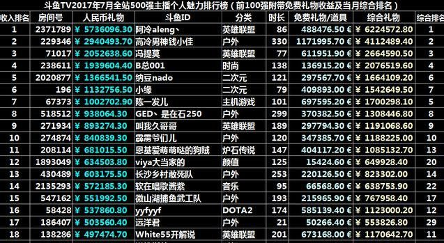
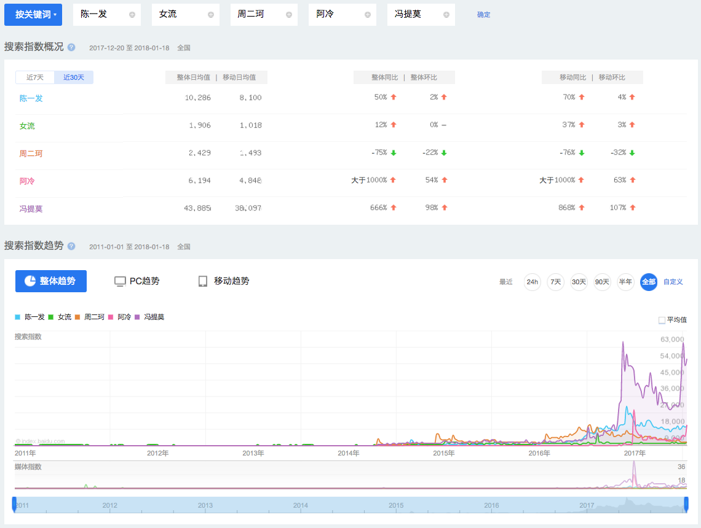

直播行业调研
===

2017直播市场报告

*** http://chanye.07073.com/shuju/1576847.html ***

* 优质的内容始终是用户的核心需求 *

# 主播收入参考

https://baijiahao.baidu.com/s?id=1574990759535182&wfr=spider&for=pc

https://tieba.baidu.com/p/5295931196?red_tag=0358661967
斗鱼一姐陈一发儿首次公开自己的收入！

分3块收入，1签约费，就是平台给的工资。2礼物费，3，广告费。陈一发的签约费应该是200到400万一年。礼物收入是40%到手，她以前一个月40到60万，现在涨到100万以上了，到手40几万人民币一个月。一年接近500万到手的礼物钱。广告费是一次几万到10几万。

这些话当然不能代表全部，但是有参考价值，假设真实度是10%-50%这个范围，也很厉害了。

挤掉泡沫，应该600到800万的年收入。娱乐主播里，她的收入算是泡沫少的，比较真实的一个。

陈一发要五百万，王思聪不愿意。后来王思聪说能给的价钱是一辆玛莎拉蒂，我还特意查了一辆玛莎拉蒂多少钱：价 格： 173.0-247.8 万元。（2015？2016？） 

## 斗鱼几个花旦的百度指数

